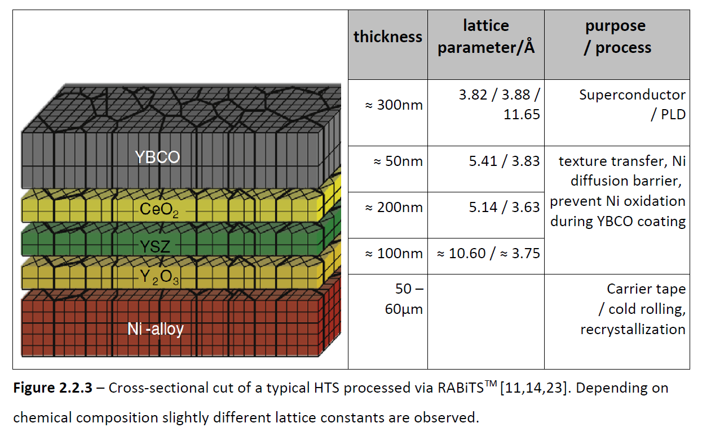

# shape and geometry of specimens and microstructural objects

## Status quo computational geometry in NeXus:
NeXus already offers a number of base classes for geometrical descriptions:
First, base classes describing affine transformations which can be chained:  
* [NXtransformations](https://manual.nexusformat.org/classes/base_classes/NXtransformations.html#nxtransformations)  
* [NXgeometry (legacy)](https://manual.nexusformat.org/classes/base_classes/NXgeometry.html)  
* [NXtranslation (legacy)](https://manual.nexusformat.org/classes/base_classes/NXtranslation.html#nxtranslation)  
* [NXshape (legacy)](https://manual.nexusformat.org/classes/base_classes/NXshape.html)  

Second, base classes and contributed classes describing geometrical primitives and shapes:  
* [NXcylindrical_geometry](https://manual.nexusformat.org/classes/base_classes/NXcylindrical_geometry.html#nxcylindrical-geometry)  

This class can be used to describe a set of cylinders. The base class entries are by design  
making references to the description of detectors. With its three vertex based definition for a cylinder  
the base class does not offer by design the most storage efficient representation of a cylinder.  

Furthermore, there are the contributed classes:  
* [NXquadric](https://manual.nexusformat.org/classes/contributed_definitions/NXquadric.html#nxquadric)  
* [NXoff_geometry](https://manual.nexusformat.org/classes/base_classes/NXoff_geometry.html#nxoff-geometry)  
* [NXcsg](https://manual.nexusformat.org/classes/contributed_definitions/NXcsg.html#nxcsg)  
* [NXsolid_geometry](https://manual.nexusformat.org/classes/contributed_definitions/NXsolid_geometry.html#nxsolid-geometry)  
which offer possibilities to describe objects via so-called constructive solid geometry (CSG).  
This is a computer aided design (CAD) approach whereby objects are described through set operations which are applied  
to objects and half-spaces through which the objects partition a domain in regions.  

Take for example a CSG description of a cylinder. We need to be precise in what we want to describe:  
* The volume  
* The volume and the surface  
* The total surface  
* One surface  (cap 1, cap 2, lateral surface)  
* The surface including the boundary  
* Only the boundary (the circle intersection between one or each cap and the lateral surface)  
With CSG set operations can be used create such descriptions:  
The three surfaces can be described as specifically parameterized quadrics.  
* Two planes (the caps)  
* One circular cylinder  

The volume including the total surface of the object is for example the intersection of the  
* Interior half-space of the cylinder quadric  
* cut with the bottom and the top half-space of the two capping planes.  

NeXus enables also to make instances of NXoff_geometry actors for the set operations. An NXoff_geometry instance  
describes each possible manifold that can be described through an [OFF file](https://de.wikipedia.org/wiki/Object_File_Format) (a CAD file format),  
i.e. usually polygon meshes or polyhedra. This enables the creation of polyhedra with curved interface segments (NEF polyhedra).  

NXsolid_geometry is the class which wraps the logical connections between the geometry instances and the applied set operations.  
More specifically, NXsolid_geometry is the root of the graph of NXcsg, NXoff_geometry instances which define a binary graph  
that is used frequently in the field of CSG to describe the constructed shape.  

In effect, these classes equip NeXus by design also with a description for simpler primitives like spheres, cylinders,  
or rotated bounding boxes. This description and tool set appeals to engineers and people who are knowledgable in using  
computer aided design (CAD) tools and people who are familiar with the mathematical background in this field.  

## However, this design is not ideal or eventually perceived as too complicated for average users.  

In fact, the above example documents which tricks are necessary to describe already something  
as simple as a cylinder. Using CSG throughout the entire application definition and base class  
design process can be cumbersome and difficult for non-experts. There are at least two possible solutions:  
* Implement an automated protocol that translates "simple" description into consistent CSG descriptions.  
* Implement convenient base classes to offer an alternative for frequently used primitives.  

We find the second approach the most appealing to start with because everybody understands that  
(given a definition of a unit normal) two non-overlapping points surplus an at least epsilon large  
real value as a radius define a cylinder. Specifically, a (possibly) rotated but non-degenerated cylinder.  
This motivates our here proposed additional base classes to complement the computational geometry 
capabilities of NeXus.  

**We propose to extend NeXus with a set of complementary geometric primitives.**  
Users are then free to choose which description they feel that their audience is most comfortable to work with.  

# Support packing of pieces of information by design
Currently, the above-mentioned classes have by design no method in place for packing many instances of the same class  
inside a single base class. There are relevant use cases for this though in computational materials science:  
Take for instance a computer simulation which tracks the evolution of grains, say hundred thousand grains.  
One could make each grain an own base class and thus instantiate a group for each instance with  
sub-ordinate fields (orientation, volume, etc., surface, eventually atoms and defects contained).  
This has the advantage that each grain is clearly resolved. Eventually it may require a duplication of pieces of information.  
This is for instance frequently the case when three-dimensional mesh data should be visualizable as these tools  
extend specific regular formatted input. A typical example is visualization of primitives using Paraview/HDF5/XDMF  
where specifically formatted support arrays are needed to instantiate the topology of the mesh without demanding  
further scripting by the user. Alternatively one could, already by design store only the unique  
descriptors of this grain set. For instance grain boundary data can be decoupled from the grains.  
This will then often trigger other types of support arrays to ensure the correct interpretation and linking of  
which mesh primitive is eventually shared as boundary between two adjoining crystals. Especially such support  
arrays are needed when the number of pieces of information are irregular. An example is that grains usually have  
a different number of edges, faces, and supporting vertices. The support array in such a case resolves which portions  
of the data array decode primitives of which object. This packing of many objects' values into a single field can be  
advantageous to promote storage in a compact and compressible manner. Essentially this reduces the number of nodes  
in the data description tree to reduce file handling costs. Details are implementation specific and thus classes for  
describing microstructure data have to be flexible enough to reflect these design considerations.

**We propose to realize base classes by design as sets of objects.**

# Open questions:  

* Individual base classes for polygon_soup, triangle_soup, triangle_mesh, quad_mesh, polyhedron_set, piecewise_linear_complex ?  
* Individual base classes for NXcg_sphere_set and NXcg_ellipsoid_set are both really needed, based on which decision do we propose convenience classes?
*
* Nesting of NXcg_point_set and NXcg_unit_normal_set, and NXcg_polygon_set inside the classes for the more complicated topology ?  
* What is the take on this one in other consortia? MarDI contact, INRIA's role?  
* Intersections less a priority?  
* Therefore may need to modify docstring to not write always disjoint but (ideally disjoint only)  
* CGAL uses circular iterators and half-edge-based descriptors to enforce uniqueness but [CGAL](https://doc.cgal.org/latest/Manual/packages.html#PkgHalfedgeDSo)  
*   but oftentimes many microstructure simulation codes do not reduce the primitive set to the unique ones for the sake of simplicity,  
*   or not use that level of sophistication in their implementation.
* Could we get an invitation for a review paper in a materials science journal as a consequence of which we could place our work  
*   as an attempt to a reconciliation what previous authors have done?
* How can we collect use cases (MatWerk and NFDI have many use cases, I feel it needs a glossary workshop for this as well but key people  
*   have limited resources to participate in such activities, again prioritization, focus should be on interoperability?  
*   Nomad MetaInfo does not go deep enough?  
* Multi-dimensionally-capable base classes, e.g. NXcg_ellipsoid_set how to solve that for d==2 and d==3 surface area/circumference length degenerate how to remain intuitive?
* s in NXcg_alpha_shape how to mix link and/or NXcg_point_set

**TO DO**
NXms_matpoint_set

# Non-trivial examples of how to use each base class:  

A few non-trivial examples for each base class follow that show their intended usage.  

## NXcg_point_set
* Two points identified/named as 0 and 7 in 3D space located at [-1., -2., 3.], and [2., 8, 1.4]  
dimensionality: 3  
cardinality: 2  
identifier_offset: not used because explicit naming/indexing  
identifier [0, 7]  
vertices: [[-1., -2., 3.], [2., 8, 1.4]]  
time: not used  

* Another example using the same points but now an implicit indexing and adding time data differing for each point
dimensionality: 3  
cardinality: 2  
identifier_offset: 0  
identifier: not used because implicit indexing so the zeroth row of vertices specifies the zeroth + identifier_offset-th point, the first row the first+identifier_offset-th point  
vertices: [[-1., -2., 3.], [2., 8, 1.4]]  
time: [1.2, 3.4]  

## Compare different strategies for describing layers as required for multi-layered specimens
In what follows, let's discuss an example how NeXus can be made more descriptive, which compares,
three approaches to describe the same situation. Evidently, there is likely no strategy
that pleases everybody equally conveniently.

Consider e.g. the [layer.yaml](https://github.com/FAIRmat-Experimental/data-modeling/blob/main/synthesis_and_sample/layer.yaml) turned into a minimal example (i.e. take Ni-alloy substrate Y2O3, and final layers) in the example  (Fig. 1 modified from [Durell et al.](doi:10.1088/0953-2048/22/1/013001)).  

Let's assume we cut us a rectangular specimen from the sheet with dimensions 3 times 1 cm and want to characterize it.

**NeXus schema instance without considering CSG or any new geometry base classes.**
Let's use the layer.yaml proposal and assume we use it inside some_base_class that is maybe_in_sample:  

some_base_class_maybe_in_sample/layer1/id: 1  
some_base_class_maybe_in_sample/layer1/layer_type: substrate  
some_base_class_maybe_in_sample/layer1/position: 0  
* some_base_class_maybe_sample/layer1/properties/physical/substrate_size conditional required or optional cannot work like this.  
* if the substrate_size is required it has to be made required in the appdef, but for a rectangular specimen this is evidently a conflict  
* as the base class clearly states if there is not a diam. use the next two fields...  
some_base_class_maybe_in_sample/layer1/properties/physical/substrate_length: 0.03 m  
some_base_class_maybe_in_sample/layer1/properties/physical/substrate_width: 0.01 m  
* What is a well-defined value for the thickness of the substrate ?  
some_base_class_maybe_in_sample/layer1/compositional/elements: ['Ni', 'W']  
some_base_class_maybe_in_sample/layer1/compositional/reduced_formula: 'Ni-alloy'  

some_base_class_maybe_in_sample/layer1/id: 2  
some_base_class_maybe_in_sample/layer1/layer_type: texture transfer, diffusion barrier  
some_base_class_maybe_in_sample/layer1/position: 1  
* Should one store redundant substrate_length and width ?
some_base_class_maybe_in_sample/layer1/properties/physical/thickness: 100 nm  
* How was the thickness measured?  
some_base_class_maybe_in_sample/layer1/compositional/elements: ['Y', 'O']  
some_base_class_maybe_in_sample/layer1/compositional/reduced_formula: 'Y2O3'  

* ... YSZ, CeO2 layers omitted for educational purposes... 

some_base_class_maybe_in_sample/layer1/id: 4  
some_base_class_maybe_in_sample/layer1/layer_type: superconductor  
some_base_class_maybe_in_sample/layer1/position: 5  
* Should one store redundant substrate_length and width ?
some_base_class_maybe_in_sample/layer1/properties/physical/thickness: 300 nm  
* How was the thickness measured?  
some_base_class_maybe_in_sample/layer1/compositional/elements: ['Y', 'Ba', 'Cu', 'O']  
some_base_class_maybe_in_sample/layer1/compositional/reduced_formula: 'YBCO'  

* Microstructure of each layer and interfaces is not accounted for but each layer is  
* polycrystalline, specifically the as low as possible disalignment between crystals,  
* i.e. the promotion of low-angle grain boundaries, is the key to performance.  
* Similar relevance for these microstructural features for e.g. thermoelectrics.  
* Are the layer stack dimensions matching that of the bulk? specimen/sample

Minor modifications and additions can equip this description with capabilities
to take microstructural features into account.

**NeXus schema instance using proposed non-CSG primitives otherwise the same**

Alternatively one could use proposed base classes for simple primitives to avoid
having to use the CSG capabilities for describing the geometry of all the above layers.
So let's replace substrate_size, width, and length through an instance of some base
class, maybe NXcg_root into which we put several instances of primitives (one for each layer).

some_base_class_maybe_in_sample/layer_geometry/layers  
The layers are then a group, an instance of NX_cg_cuboid_set with
cardinality: 5
identifier: [1, 2, 3, 4, 5]
* One would describe the specimen with vertices and store these under support:
* Vertices in the plane between adjoining layers are shared so we need to store 4 + 4 times 4 + 4 vertices.
* One would have to store the quads for each cuboid.  
* One would have to duplicate these quads though for each cuboid.  
* Evidently this makes a point that defining something like an NXcg_stack could be useful.  

The disadvantage of this more explicit description is that inconvenient and maybe difficult to do in
practice one has to specify the shapes explicitly via the vertices and the quad, i.e. the topology of the mesh.
On the flipside such a description has the advantage that it can be directly used and incentivize developers of consuming software tools to write a tool from which the geometry can be instantiated programmatically. This is effectively what virtually every continuum microstructure evolution modeling tool does in the computational materials science, though, with as many descriptions right now as there are tools out there. This is where NeXus could offer a benefit as it narrows down the controlled vocabulary into reusable base classes that can be coupled to an ontology.

* It would be required though for the above example to add an NXtransformations somewhere which gives the global context in which the NXcg_cuboid objects are defined  

Without the global context in the NXtransformations, there is another issue with the first, layer.yaml-based description: There is no explicit connectivity information. This works because we as humans understand that we are talking implicitly about layers which are arranged, given the research field, usually as a stack of layers; however, how should a machine understand this? How should a machine be able to programmatically verify that this is a valid description? An approach could be to check if the layer IDs are consistent but then they have it has to be defined in an appdef and docstring how such IDs have to be used. The second example with the NXcg_cuboid_set defines this rule set.  

On the flipside the NXcg_cuboid_set does not define though explicitly that the interfaces between
the cuboids/or NXcg_cylinders (in the case of disk-shape specimen) represent features in the specimen that are worth further descriptions.

One could solve this dilemna in both examples through adding base classes that refer to topological information, i.e. the interface between layer 3 and 4 is a
phase boundary between YBCO and CeO2. The advantage of the NXcg_cuboid/NXcg_cylinder based approach is that the geometry of this layer is already defined.

*some_base_class_maybe_in_sample/layer_geometry/interfaces* could be an approach to nest these pieces of information.

**NeXus schema instance using CSG descriptions of half-spaces**

As another alternative to describe the same specimen one could use the in-build CSG capabilities of NeXus. Specifically, CSG can be used to describe these multi-layers pragmatically including the rule set. But this descriptions turns out to be maybe even less intuitive.

One CSG-approach could be to define for each layer two delineating bounding planes; say an upper and a lower interface for instance. The layer in between at this point is an infinite slab or disk respectively. So one could add four additional planes that cut the infinite layers into a cuboid or cylindrical disk. Again data are duplicated by design because now each layer has to define the additional four planes. Such a data duplication could be in fact unnecessary if all layers are really covering the entire specimen surface.
When the layers have in fact a different coverage of the specimen though, the CSG, and NXcg_cuboid description is not data duplication but rather offers
a clean description how the layers are differently shaped; which is not covered right now by layer.yaml. In fact this approach makes at the moment no statement/metadata in this direction.

One could avoid data duplication if one pulls the specimen-constraining planes out of the layers group. Thus one describes that the layer stack forms overall a (cuboidal or disk-shaped respectively) specimen and in doing so one could put the four globally cutting planes elsewhere into the application definition. Maybe under the sample geometry.

An example following this approach using CSG exemplified for the Y2O3 layer could then look as follows:  
* Two NXquadric instances are required, both of them are planes.  
* These planes have to be fully parameterized  
* Thereby, one not only says we have a so-and-so-thick layer but there is a layer that is precisely located relative the coordinate system.  
* For instantiating a computer simulation this can be useful if not be a requirement.  
* Specifically the planes would have opposite normals, realized via the parameterization of the quadric.  
* Thus, the planes point into their respective positive half-spaces.  
* The negative half-space behind the plane is the volume that when intersected by the half-space of the other plane,  
* yields an infinitely extended slab with a well-defined thickness.  
* If the resulting infinite slab is again intersected with the interior half-space of a circular quadric the  
* CSG-operations define a specifically oriented disk-shaped layer with a precisely defined diameter and  
* thickness thus replacing substrate_size, length and width.  
* Alternatively using four quadrics, or even simpler a cuboid that is parameterized through an NXoff_geometry, instance yields the cuboidal specimen.  
* The combination of NXoff_geometry and NXquadric makes the CSG approach a de facto more generalized approach.  

**We learn from this example that there is no golden-bullet how to describe this multi-layer example;**  
**however we also learn how NeXus can be customized or used already as is to extend the applicability**  
**of the layer.yaml description wrt to making additional statements towards a more precise**  
**geometrical description of the sample.**  

** Furthermore, we learn that we need also an example for how to describe e.g. the polycrystalline structure of each layer.**  

We may place this under sample. On the flipside how do we know that the layer is specifically polycrystalline, with well defined crystals,
eventually even two-dimensionally or three-dimensionally resolved crystals, for this one could perform characterization experiments.
This makes a clear point that these descriptions should not be placed into the sample, as it blurs the provenance and history how we learned
how and what makes up our specimen's microstructure and composition.

